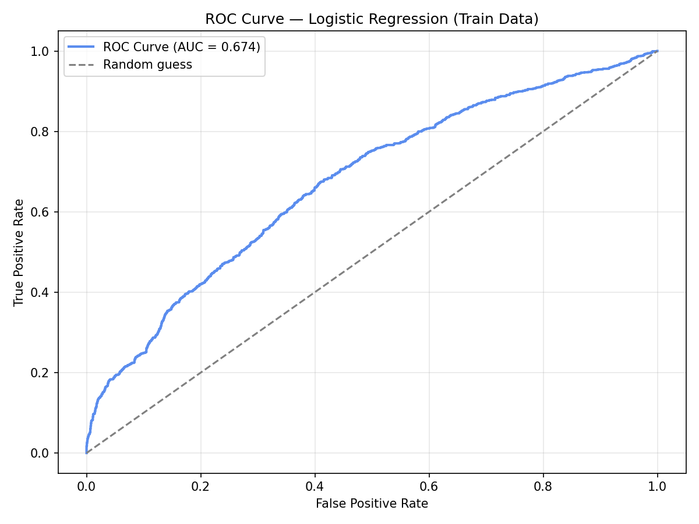
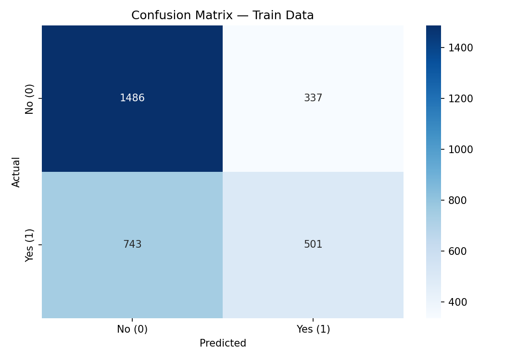
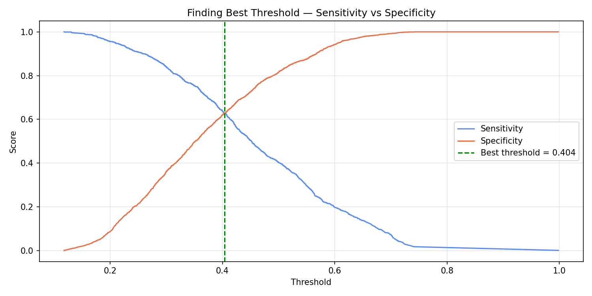

# Retail analytics capstone project

# Retail Customer Analytics

---

# Retail Customer Analytics
### A Machine Learning Approach

---

## What is this project?

This project looks at data from a retail shop in the UK.
I used Python to find useful information about customers
and answer three simple business questions:

1. Who are the customers and how are they different from each other?
2. Which customers will say yes to a marketing email?
3. What are customers complaining about?

To answer these questions I built three machine learning models:
- **Customer Segmentation** — groups customers by shopping behaviour
- **Campaign Response Model** — predicts who will respond to a marketing offer
- **Sentiment Analysis** — reads complaint text and finds the main problems

The final result is a live web dashboard that anyone can use
to explore the results — no coding needed!

---

## Tools and Libraries used

| Tool | What I used it for |
|------|-------------------|
| Python | Main programming language |
| pandas | Loading and cleaning data |
| numpy | Working with numbers |
| matplotlib | Making charts and graphs |
| seaborn | Making better looking charts |
| scikit-learn | Building machine learning models |
| statsmodels | Checking multicollinearity (VIF) |
| vaderSentiment | Reading and scoring complaint text |
| Streamlit | Building the interactive dashboard |
| FastAPI | Building the web API (REST API) |
| Docker | Packaging the app into a container |
| Render | Hosting the app online for free |
| Jupyter | Writing and running the code notebooks |
| Git + GitHub | Saving and sharing the project code |

---

## How the app works

---

## How to open and run this project
1. Open VS Code
2. Open the terminal and type: `conda activate base`
3. Open any notebook from the notebooks folder
4. Press **Run All** at the top to run the code

---

## Data used
| File | What it contains | Number of rows |
|------|-----------------|----------------|
| Online Retail Sales Data.csv | All customer purchases in 2023 | 337,321 |
| Campaign Response.csv | Did customers respond to a marketing email? | 3,834 |

---

### Folder structure

## Phase 1 — Cleaning and Preparing the Data 
**File:** `notebooks/01_data_cleaning.ipynb`

### What I did:
- Loaded both files and looked at what was inside
- Removed 6,939 rows where quantity was negative
  (these were returned items)
- Removed 23 rows where price was zero or negative
- Removed 4,657 duplicate rows
- Fixed the date column so Python can read it properly
- Fixed the NPS column so Python sees it as a number

### New columns I created:
| Name | What it means |
|------|--------------|
| Total_Spending | How much money each customer spent in total |
| Purchase_Frequency | How many times each customer bought something |
| Recency | How many days since the customer last bought |
| Unique_Products | How many different products the customer bought |
| Avg_Basket_Size | How much the customer spends on average per visit |

### What I found:
- 4 out of 10 customers responded to the campaign (40.6%)
- Most customers are unhappy based on their NPS score
- Final dataset has 3,834 customers and 12 columns

---

**File:** `notebooks/02_eda.ipynb`

### What I did:
- Made box plots to compare happy vs unhappy customers
- Made tables showing who responds to campaigns
- Made bar charts comparing customers who said yes vs no
- Made a chart showing sales every month
- Found the top 10 best selling products

### What I found:
- Customers in the loyalty program respond more (47.1% vs 31.9%)
- ALL happy customers (NPS 9-10) responded to the campaign!
- November was the best month for sales — almost £1 million
- Best selling product was PAPER CRAFT LITTLE BIRDIE — £168,470
- Customers who responded spent more money on average (£1,960 vs £1,641)

---

## Phase 2 — Looking at the Data with Charts 

### Monthly Sales Trend

### Top 10 Products

### Box-Whisker Plots

### Bar Charts — Features by Response

## Phase 3 — Building a Model to Predict Campaign Response 

**File:** `notebooks/04_campaign_model.ipynb`

### What is this phase about?
In this phase I built a model that can predict
if a customer will say YES or NO to a marketing email.

I used a method called Binary Logistic Regression.
This is one of the most common methods used in business
to predict yes or no answers.

---

### How I built the model

**Step 1 — Split the data**
I took all 3,834 customers and split them into two groups:
- 3,067 customers → used to TEACH the model (80%)
- 767 customers → used to TEST if model works (20%)

This is like studying from a textbook and then 
sitting an exam with new questions.

**Step 2 — Choose what to give the model**
I gave the model 9 pieces of information about each customer:

| Information | What it means |
|-------------|---------------|
| Total_Spending | How much money the customer spent |
| Purchase_Frequency | How many times they bought something |
| Recency | How many days since they last bought |
| Unique_Products | How many different products they bought |
| Avg_Basket_Size | How much they spend on average per visit |
| nps | How happy the customer is (score 0-10) |
| n_comp | How many complaints they made |
| n_communications | How many times we contacted them |
| loyalty | Are they a loyalty member? Yes or No |

**Step 3 — Check features are not too similar**
I checked that none of the 9 features are 
saying the same thing twice.
This check is called VIF (Variance Inflation Factor).

Result — all values were below 5 which means 
everything is fine and we can use all 9 features! 

| Feature | VIF Score | Is it okay? |
|---------|-----------|-------------|
| n_communications | 4.79 | ✅ below 5 |
| nps | 3.43 | ✅ below 5 |
| n_comp | 3.09 | ✅ below 5 |
| Purchase_Frequency | 3.08 | ✅ below 5 |
| Unique_Products | 2.64 | ✅ below 5 |
| loyalty | 2.22 | ✅ below 5 |
| Total_Spending | 2.04 | ✅ below 5 |
| Recency | 1.65 | ✅ below 5 |
| Avg_Basket_Size | 1.50 | ✅ below 5 |

---

### What the model learned

The model looks at all 9 features and gives 
each one a score called a coefficient.

Positive score = this feature helps predict YES
Negative score = this feature helps predict NO

| Feature | Score | What it means |
|---------|-------|---------------|
| nps | +0.469 | Happy customers respond more |
| loyalty | +0.294 | Loyalty members respond more |
| n_communications | +0.225 | More contact = more response |
| n_comp | -0.129 | More complaints = less response |

The most important feature is NPS — 
this matches what we found in Phase 2! 

---

### How good is the model?

I used a score called AUC to measure how good the model is:
- AUC = 0.5 means the model is just guessing
- AUC = 1.0 means the model is perfect
- Our model AUC = **0.674** — better than guessing! 

| What we measured | Score | Simple meaning |
|-----------------|-------|----------------|
| AUC | 0.674 | Better than random guessing |
| Accuracy | 0.648 | Correct 65% of the time |
| Sensitivity | 0.403 | Finds 40% of YES customers |
| Specificity | 0.815 | Finds 82% of NO customers |

---

### Finding the best threshold

The model gives each customer a score between 0 and 1.
We need to decide — what is the minimum score to say YES?
This minimum score is called the threshold.

Default threshold = 0.5
Best threshold found = **0.404**

Using 0.404 instead of 0.5 gives us:
- Sensitivity = 0.62 (finds more YES customers!)
- Specificity = 0.62 (balanced with sensitivity)

---

### Charts from this phase

**ROC Curve — shows how good the model is:**

**Confusion Matrix — shows right and wrong predictions:**

**Best Threshold Chart:**

---

### Main findings from Phase 3
- Happy customers (high NPS) are most likely to respond
- Loyalty members respond much more than non-members
- Customers with more complaints respond less
- The model works better than random guessing
- Best threshold is 0.404 not the default 0.5

