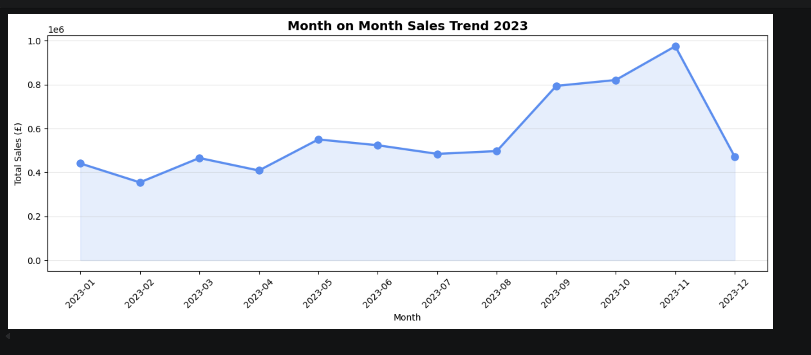
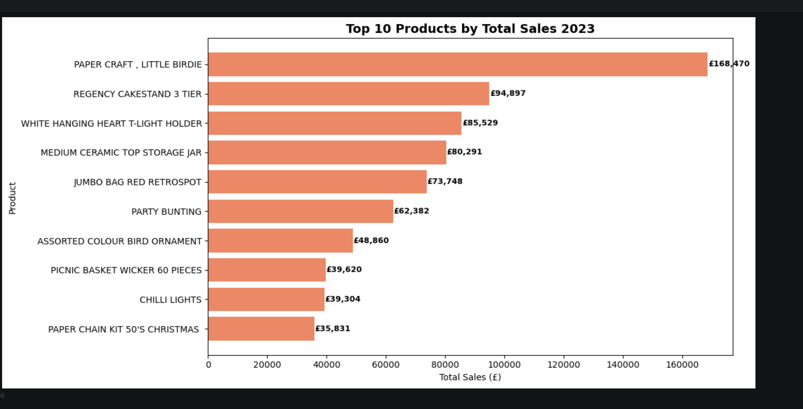
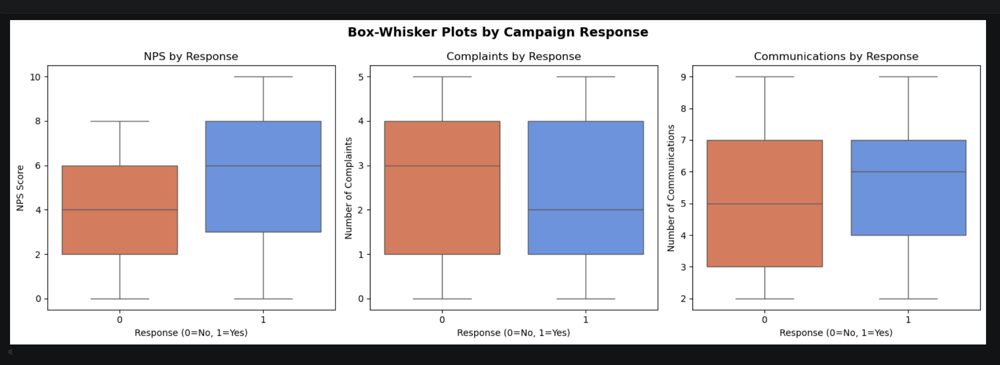
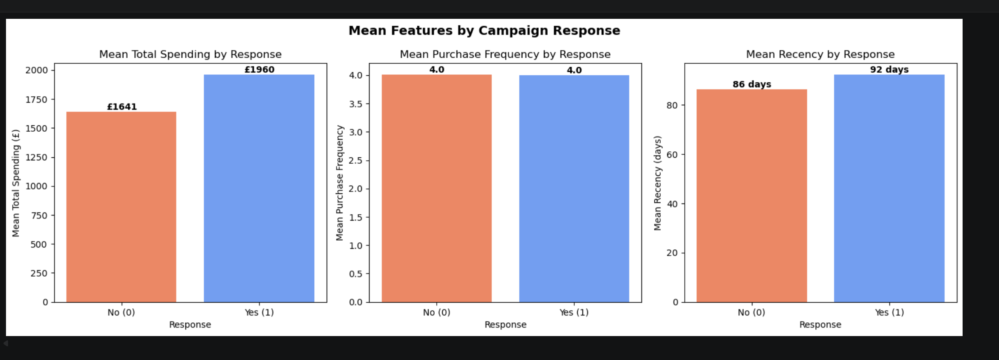
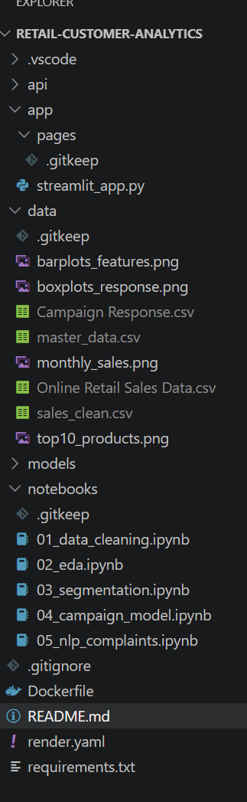

# Retail analytics capstone project

# Retail Customer Analytics

---

## What is this project?
This project looks at data from a retail shop.
I used Python to find useful information about customers
and answer three simple questions:

1. Who are the customers and how are they different from each other?
2. Which customers will say yes to a marketing offer?
3. What are customers complaining about?

---

## How to open and run this project
1. Open VS Code
2. Open the terminal and type: `conda activate base`
3. Open any notebook from the notebooks folder
4. Press **Run All** at the top to run the code

---

## Data used
| File | What it contains | Number of rows |
|------|-----------------|----------------|
| Online Retail Sales Data.csv | All customer purchases in 2023 | 337,321 |
| Campaign Response.csv | Did customers respond to a marketing email? | 3,834 |

---

## Phase 1 — Cleaning and Preparing the Data 
**File:** `notebooks/01_data_cleaning.ipynb`

### What I did:
- Loaded both files and looked at what was inside
- Removed 6,939 rows where quantity was negative
  (these were returned items)
- Removed 23 rows where price was zero or negative
- Removed 4,657 duplicate rows
- Fixed the date column so Python can read it properly
- Fixed the NPS column so Python sees it as a number

### New columns I created:
| Name | What it means |
|------|--------------|
| Total_Spending | How much money each customer spent in total |
| Purchase_Frequency | How many times each customer bought something |
| Recency | How many days since the customer last bought |
| Unique_Products | How many different products the customer bought |
| Avg_Basket_Size | How much the customer spends on average per visit |

### What I found:
- 4 out of 10 customers responded to the campaign (40.6%)
- Most customers are unhappy based on their NPS score
- Final dataset has 3,834 customers and 12 columns

---

## Phase 2 — Looking at the Data with Charts 

**File:** `notebooks/02_eda.ipynb`

### What I did:
- Made box plots to compare happy vs unhappy customers
- Made tables showing who responds to campaigns
- Made bar charts comparing customers who said yes vs no
- Made a chart showing sales every month
- Found the top 10 best selling products

### What I found:
- Customers in the loyalty program respond more (47.1% vs 31.9%)
- ALL happy customers (NPS 9-10) responded to the campaign!
- November was the best month for sales — almost £1 million
- Best selling product was PAPER CRAFT LITTLE BIRDIE — £168,470
- Customers who responded spent more money on average (£1,960 vs £1,641)

---

## Phase 2 — Looking at the Data with Charts ✅

### Monthly Sales Trend

### Top 10 Products

### Box-Whisker Plots

### Bar Charts — Features by Response

### Folder structure

